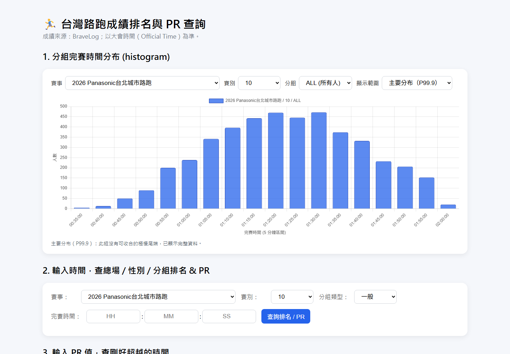

# 台灣馬拉松成績排名與 PR 查詢

[開啟網頁](https://b03901165shih.github.io/2026-taiwan-marathon-stats/)

收錄 2025–2026 年的 10 場路跑賽事。輸入完賽時間可查排名與 PR（超越百分比），也能由 PR 反查時間，或比較不同賽事中相同距離的成績分布。

> 本工具以成績資料中的大會時間計算，並排除無有效完賽時間的紀錄；結果可能與淨時間或官方排名不同。



---

## 功能

| 功能 | 操作 | 輸出 |
|------|------|------|
| **分布圖** | 選賽事、賽別、分組與顯示範圍 | 5 分鐘區間完賽時間長條圖；預設顯示主要分布（P99.9），可切換完整範圍 |
| **查排名** | 輸入 `HH:MM:SS` | 全場+性別+細組精準 **PR%** |
| **查時間** | 輸入 **PR%** | 剛好超越的完賽時間 |
| **跨賽事比較** | 選參考賽事、賽別與完賽時間 | 只列同距離賽別的總場、男性、女性排名與 PR；同場多個同距離賽別各列一行 |

跨賽事比較以賽事設定中的實際距離配對。例如 Panasonic 成績頁的賽別代碼 `10` 對應 12.5K，不會與 10K 或半馬混用。

---

## 已收錄賽事

| 年份 | 賽事 | 收錄距離 |
| --- | --- | --- |
| 2025 | Panasonic TAIPEI CITY RUN 台北城市路跑賽 | 12.5K |
| 2025 | 統一發票盃路跑活動 | 10K、半馬 |
| 2025 | 長榮航空馬拉松 | 10K、半馬、全馬 |
| 2025 | 台北馬拉松 | 半馬、全馬 |
| 2026 | 渣打台北公益馬拉松 | 11K、半馬、全馬 |
| 2026 | 臺南古都國際半程馬拉松 | 10K、半馬 |
| 2026 | 南山人壽臺北國道馬拉松 | 半馬、全馬 |
| 2026 | PUMA 螢光夜跑 | 10K、半馬 |
| 2026 | 國家地理路跑 | 5K、10K、半馬 |
| 2026 | Panasonic 台北城市路跑 | 12.5K |

賽別名稱、距離與來源網址以 [`events_config.json`](events_config.json) 為準。網站實際載入的成績位於 `data/<event_id>_data.js`，由 [`index.html`](index.html) 引用。

## 專案結構

```text
index.html                網站入口
data/                     各賽事的前端成績 JS
assets/                   README 介面截圖
events_config.json        賽事與距離設定
scrap_result.py           擷取原始成績
extract_excel_result.py   Excel 轉成 data/ 中的 JS
WORKFLOW.md               新增賽事與驗證步驟
```

## 資料更新

`scrap_result.py` 擷取成績並產生 Excel；`extract_excel_result.py` 依 `events_config.json` 把 Excel 轉成 `data/` 中的 JS。新增賽事時，還需將新的 JS 以 `<script>` 加入 `index.html`。完整操作與驗證步驟見 [`WORKFLOW.md`](WORKFLOW.md)。

這次新增的四份原始 Excel 含跑者姓名與背號，僅保留在本機、未推送到 GitHub；前端查詢使用 JS，不需下載 Excel。
